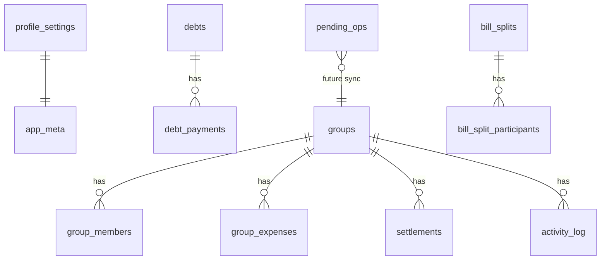

# Offline storage (SQLite + Drizzle)

Debtly persists all app data on device using **expo-sqlite** and **Drizzle ORM**. Zustand stores hold in-memory state for the UI; the database is the durable source of truth.

## Stack

| Layer | Package | Role |
|-------|---------|------|
| Driver | `expo-sqlite` | Native SQLite (Expo Go, dev builds, production) |
| ORM | `drizzle-orm` | Typed schema, queries, transactions |
| Migrations | `drizzle-kit` + `babel-plugin-inline-import` | SQL files bundled into the app |
| UI state | Zustand | Ephemeral cache; hydrated once at launch |

We use **expo-sqlite** rather than `@op-engineering/op-sqlite` for first-party Expo support and simpler tooling. op-sqlite is an option if profiling shows SQLite as a bottleneck at very large data sizes.

## Folder layout

```
lib/db/
  schema.ts              # Drizzle table definitions
  client.ts              # openDatabase(), getDb()
  migrate.ts             # run SQL migrations on boot
  bootstrap.ts           # migrate → legacy import → hydrate
  hydrate.ts             # load DB → Zustand stores
  persistence.ts         # debounced store → DB subscriptions
  importFromLegacyStorage.ts
  clearAllData.ts
  mappers/               # Row ↔ domain type
  repositories/          # loadAll / replaceAll per domain
drizzle/migrations/      # Generated SQL + journal
components/DatabaseProvider.tsx
```

## Schema overview



- **Personal ledger**: `debts`, `debt_payments`
- **Groups**: `groups`, `group_members`, `group_expenses`, `settlements`, `activity_log`
- **Legacy bill split tab**: `bill_splits`, `bill_split_participants`
- **Settings**: `profile_settings` (single row, `id = 1`)
- **Meta**: `app_meta` (e.g. `legacy_import_done`)
- **Future Convex sync**: `pending_ops` (outbox; empty until cloud sync ships)

## Boot sequence

1. `SQLiteProvider` opens `debtly.db` and runs `onInit`.
2. `PRAGMA journal_mode=WAL` and `foreign_keys=ON`.
3. Drizzle migrator applies `drizzle/migrations/*.sql`.
4. If `legacy_import_done` is not set, read old AsyncStorage keys and import (see below).
5. `hydrateStoresFromDatabase()` loads rows into Zustand.
6. `syncGroupDebtsToLedger` runs for each group.
7. `attachStorePersistence()` debounces store changes back to SQLite (~300ms).

Until step 7 completes, the root layout shows a loading indicator (no flash of mock seed data).

## Legacy AsyncStorage import

One-time migration from Zustand persist keys:

| Key | Content |
|-----|---------|
| `debtly-debts` | Personal debts |
| `debtly-group-expenses` | Groups / expenses / settlements |
| `debtly-profile` | Profile settings |
| `debtly-bill-splits` | Legacy bill splits (also used as old group fallback) |

Import uses existing domain migrations (`migrateDebts`, `migratePersistedState`, `migrateGroupPersistedState`). AsyncStorage keys are **not** deleted automatically so you can roll back if needed.

## Runtime writes

All user edits go through Zustand actions as before. Subscribers call `replaceDebts`, `replaceGroupState`, etc., which run in a single SQLite transaction per domain.

**Do not** re-enable `zustand/middleware` `persist` for migrated stores.

## Adding a schema change

1. Edit [`lib/db/schema.ts`](../lib/db/schema.ts).
2. Run `pnpm db:generate` to create a new SQL file under `drizzle/migrations/`.
3. Register the new `.sql` file in [`drizzle/migrations/migrations.ts`](../drizzle/migrations/migrations.ts) and update [`drizzle/migrations/meta/_journal.json`](../drizzle/migrations/meta/_journal.json) (drizzle-kit usually does both).
4. Add mapper/repository fields if needed.
5. Test on a device/simulator; the migrator runs automatically on next launch.

## Debugging

- **Expo CLI**: press `Shift+M` → “Open expo-sqlite” to inspect tables in the browser.
- **Optional**: [drizzle-studio-expo](https://github.com/drizzle-team/drizzle-studio-expo) for Drizzle Studio against the on-device DB.
- **Clear data**: Profile → Clear all data (wipes SQLite + resets stores).

## Future Convex sync (groups)

Local-first pattern for shared groups:

1. User action → write SQLite immediately → append `pending_ops`.
2. Online → push mutations to Convex (idempotent `clientId`).
3. Convex subscription → upsert remote changes into SQLite → refresh Zustand.

Implement `IGroupExpenseRepository` with a remote adapter; keep SQLite as the offline cache. See [`features/group-expense/repository/types.ts`](../features/group-expense/repository/types.ts).

## Web

`expo-sqlite` web support is alpha and requires Metro/COOP/COEP headers. Debtly targets iOS/Android; web may need extra config if you ship it.

## Scripts

```bash
pnpm db:generate   # drizzle-kit generate after schema edits
pnpm test          # mapper + legacy parse tests
```
